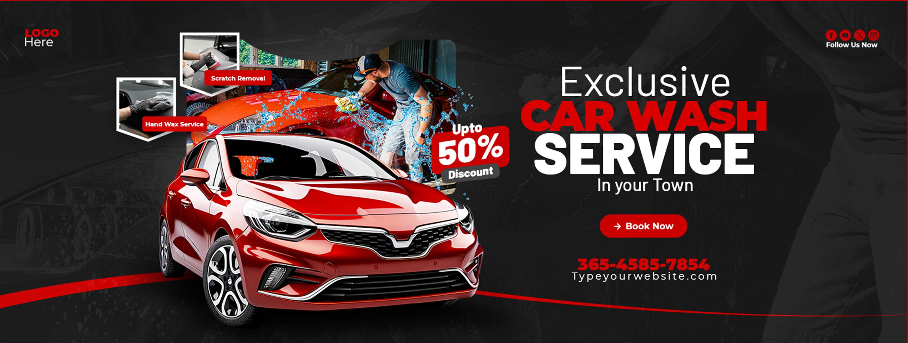

# 🚘 Car-Life BD

A responsive car-related website built using **HTML**, **CSS**, **Bootstrap 5**, **JavaScript**, and **Font Awesome**.

---

## 🔧 Project Overview

**Car-Life BD** is a responsive car showcase web application designed to highlight new car arrivals, vehicle details, and automotive features in a sleek, user-friendly interface. The site is built with modern web technologies and follows mobile-first design principles. **Font Awesome icons** are used to enhance the UI and improve accessibility.

---

## 🔗 Live Link

🌐 [Visit Car-Life BD](https://ah-sunny.github.io/Car-life-BD-bootstrap-project-/)

> 

---

## ✨ Features

- 🚗 Responsive layout using Bootstrap Grid System
- 📦 Dynamically generated "New Arrivals" section using JavaScript and object-based data
- 🎨 Fixed-height cards with Flexbox for evenly distributed content
- 🔍 Font Awesome icons integrated throughout the UI
- 🌈 Gradient backgrounds with pink-to-black styling
- 🖥️ Optimized for all screen sizes (desktop, tablet, mobile)

---

## 🛠️ Tech Stack

- **HTML5**
- **CSS3**
- **Bootstrap 5**
- **JavaScript (ES6)**
- **Font Awesome**

---

## 📸 Screenshots

*(Here are some sample visuals used in the website:)*

---

## 📁 Folder Structure

├── assets/
│ ├── css/
│ │ └── style.css
│ └── image/
│ ├── banner/
│ │ └── pngwing.com (6).png
│ ├─├── newArrival/
│ │ └── pngwing.com (6).png
│ ├── favicon.ico
│ └── pngwing.com.png
├── index.html
└── README.md